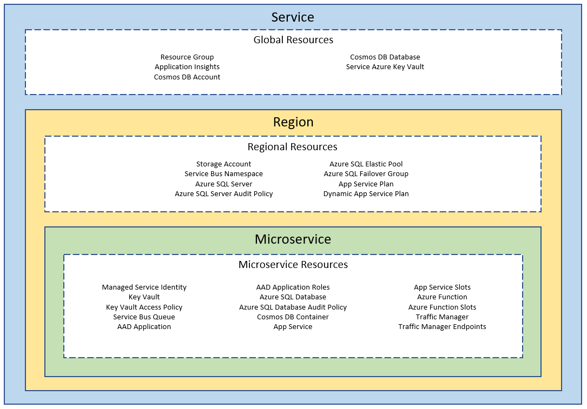

# Terraform module for standardizing microservice infrastructure provisioning

This module is to help standardize microservice provisioning

Documentation will be added soon

## Features

Provisioning multi-region microservices on Azure with minimal input to describe your service

Hosting Configurations:
* App Service
* Functions

Data Store Configurations:
* SQL Elastic Pool
* CosmosDB

Additional Configurations:
* Application Insights
* Storage
* Key Vault
* Deployment Slots
* Managed Identity
* Traffic Manager
* SQL Failover Group

## Structure



## Usage

For large services there are sometimes conflict issues between app service slots, function app slots, and traffic manager. To avoid these issues until this can be resolved you can run apply with the `-parallelism=1` argument

```
terraform apply -parallelism=1 "dev.tfplan"
```

```hcl
module "microservice" {
  source = "Matthewsre/microservices/azurerm"

  service_name = "myservice"
  regions      = ["westus2", "eastus"]
  environment  = "dev"

  microservices = [
    {
      name       = "service1"
      appservice = "plan"
    },
    {
      name       = "service2"
      appservice = "plan"
      function   = "plan"
      cosmos_containers = [
        {
          name               = "container1"
          partition_key_path = "/PartitionKey"
          max_throughput     = 0
        }
      ]
    },
    {
      name       = "service3"
      appservice = "plan"
      function   = "consumption"
      sql        = "elastic"
    },
    {
      name       = "service4"
      appservice = "plan"
      sql        = "elastic"
    },
    {
      name       = "service5"
      appservice = "plan"
      cosmos_containers = [
        {
          name               = "container2"
          partition_key_path = "/PartitionKey"
          max_throughput     = 0
        }
      ]
    }
  ]
}

```

# Resource Naming Conventions

Names for resources will be derived from the variables provided:
* service_name
* environment
* regions
* microservice.name
* environment_differentiator (optional)

## Global Names

Standard names for global resources will be

```
# example "myservice-prd"
"${service_name}-${environment}"
```
Differentiators are available for scenarios such as
1. Multiple test/ppe environments needed for validating different features
2. Multiple dev environments needed for different developers
3. Multiple instances in production (beta, migrations, etc.)

If an environment_differentiator is provided it will be:

```
# example "myservice-env2-ppe"
"${service_name}-${environment_differentiator}-${environment}"
```

Environment differentiators will automatically be provided by default for the dev environment based on the logged in user. If an environment_differentiator is provided that will be used instead of the logged in user.

```
# example "myservice-matthewsre-dev"
"${service_name}-${environment_differentiator}-${environment}"
```

## Region Resource Names

Names for regional resources will include the region when naming requirement must be unique. The environment_differentiator will be included based on same criteria from global rules.

```
# example "myservice-westus2-tst"
"${service_name}-${region}-${environment}"

# example "myservice-westus2-matthewsre-tst"
"${service_name}-${region}-${environment_differentiator}-${environment}"

```

## Microservice Resource Names

Microservices will use thier provided microservice.name instead of the service_name. For this reason a **microservice.name should not be the same as the service_name**. Terraform does not currently support validation on multiple attributes. The names will also include the region when naming requirement must be unique.

```
# example "finance-prd"
"${microservice.name}-${environment}"

# example "finance-matthewsre-dev"
"${microservice.name}-${environment_differentiator}-${environment}"

# example "finance-westus2-ppe"
"${microservice.name}-${region}-${environment}"

# example "finance-westus2-feature1-tst"
"${microservice.name}-${region}-${environment_differentiator}-${environment}"
```

## Naming Exceptions

Storage Accounts and Key Vaults have restrictions to 24 characters. To reduce issues with this you should try to keep the combined length of variables under 24 characters

Storage Account Example
```hcl
# Example "myservicewestus2prd"
"${service_name}${region}${environment}"
```

KeyVault Examples
```hcl
# Global Example "myservice-prd"
"${service_name}-${environment}"

# Microservice Example "finance-prd"
"${microservice.name}-${environment}"
```

When using environment_differentiator we automatically try to accomodate the length restrictions on these resources and will shorten this value to fit. See the following examples for how the environment_differentiator "matthewsre" will be shortened

Storage Account Example
```hcl
# Example "myservice2westus2matthprd"
"${service_name}${region}${environment}"
```

KeyVault
```hcl
# Global Example "myservice2-matthewsr-prd"
"${service_name}-${environment}"

# Microservice Example "financials-matthewsr-prd"
"${microservice.name}-${environment}"
```

# Global Resources

## Primary Region

The order of the regions passed into the region variable is used to determine the primary region that will be used for global resources.

```hcl
module "microservice" {
  source = "Matthewsre/microservices/azurerm"

  ...

  regions = [
    "westus2",  # <== Primary Region
    "eastus",   # <== Secondary Region
    "japan"
  ]
}
```

## Resource Group (azurerm_resource_group)

All resources for the service will be put into a single global resource group.

If tags are needed on the resource group you can pass them into the resource_group_tags variable:

```hcl
module "microservice" {
  source = "Matthewsre/microservices/azurerm"

  ...

  resource_group_tags = {
    environment = "production"
    role        = "service"
    foo         = "bar"
  }
}
```

## Application Insights (azurerm_application_insights)

A single Application Insights instance will be created and will be added to the configuration of App Services and Function Apps.

The retention_in_days variable, which defaults to 90 and is used for multiple resource types, sets the retention period for Application Insights.

The application_insights_application_type is used to specify the type to create. Default is "web".

Configurations will be set on the App Service and Function Apps:
```
"APPINSIGHTS_INSTRUMENTATIONKEY"
"APPLICATIONINSIGHTS_CONNECTION_STRING"
"ApplicationInsightsAgent_EXTENSION_VERSION" # ("~2")
"ApplicationInsights:InstrumentationKey"
```

## Azure CosmosDB Account (azurerm_cosmosdb_account)

A single Cosmos DB Account will be created if any of the microservices have a container specified.

```hcl
module "microservice" {
  source = "Matthewsre/microservices/azurerm"

  ...

  microservices = [
    {
      ...
    
      cosmos_containers = [
        {
          name               = "AppObjectContainer"
          partition_key_path = "/PartitionKey"
          max_throughput     = 0
        },
    }
  ]
}
```

 The Cosmos DB Location will be set to the primary region. Any additional regions will be added as geo_locations with a failover priority that matches their index specified.

```hcl
module "microservice" {
  source = "Matthewsre/microservices/azurerm"

  ...

  regions = [
    "westus2",  # <== failover_priority = 0
    "eastus",   # <== failover_priority = 1
    "japan"     # <== failover_priority = 2
  ]
}
```

The cosmos_enable_free_tier variable can optionally be set to true to enable the free tier pricing option.

The cosmos_enable_automatic_failover variable can optionally be set.

## Key Vault (azurerm_key_vault)

A global Key Vault is configured to store secrets for global resources. Currently the sql-admin-login and randomly generated sql-admin-password are stored in this vault. There are also separate Key Vaults created for each service.

An access policy is added for the current account Terraform is running under to enable management of secrets. The default values for this policy include all permissions and can be modified using the key_vault_permissions variable.

The network acls can also be set on Key Vault using the key_vault_network_acls variable. If the key_vault_include_ip_address variable is set then the current executions external ip address will be looked up and added to the ip_rules of that object.

When using "dev" as the environment, no network_acl is specified, and key_vault_include_ip_address is not specified then a default policy will be added with an exception for the current ip address. This is to help ease pain points when working from dev envrionments, but the ip address found externally might not always match what is seen by Azure due to firewall configurations.  

# Regional Resources

## Azure Storage Account (azurerm_storage_account)

A Storage Account is created in each region specified.

The storage_account_tier and storage_account_replication_type variables are used when configuring this account.

## Servicebus Namespace (azurerm_servicebus_namespace)

A ServiceBus namespace is created in each region specified only if any of the microservices have a queue specified. If no services have queues, then nothing will be created.

The servicebus_sku variable is used for this configuration. 

*ServiceBus region pairing is not yet configurable in this module.*

## Azure SQL Server (azurerm_mssql_server, azurerm_mssql_elasticpool, azurerm_sql_failover_group)

An Azure SQL Server is created in each region specified only if any of the microservices have sql specified. If no services have queues, then nothing will be created.

The options for SQL in each microservice are "server" and "elastic". If any service has the elastic option set, then an elastic pool will also be created.

The storage accounts created in each region will be used when creating the SQL Server.

The login and password will be the same across all regions and stored in the global Key Vault.

The sql_version and sql_minimum_tls_version can be used to configure the server settings.

The sql_elasticpool_max_size_gb, sql_elasticpool_sku, and sql_elasticpool_per_database_settings can be used to configure the elastic pool options from the defaults.

The sql_database_collation and sql_database_sku will be the default values for all databases created for each service. If the database is elastic then sql_database_sku will not be used.

## App Service Plans (azurerm_app_service_plan)

An App Service Plan is created in each region specified if any of the microservices have appservice or function specified.

The only option currently for appservice in each microservice is "plan".

The options for function in each microservice is "plan" or "consumption". A service can have both appservice and function provided.

An App Service Plan will be created based on the appservice_plan_tier and appservice_plan_size variables if there are any microservices with appservice or function set to "plan".

A separate dynamic App Service Plan will be created if there are any microservices with function set to "consumption".


# Microservice Resources

## Managed Service Identities (azurerm_user_assigned_identity)

Each App Service and Function App will have a system assigned identity created.

Each App Service and Function App will also have a user assigned identities created for KeyVault, SQL Server, ServiceBus, and CosmosDB.

The ID's of user assigned identities will be provided in the App Service and Function App Settings

```
"KeyVault:ManagedServiceAppId"
"Database:ManagedServiceAppId"
"ServiceBus:ManagedServiceAppId"
"DocumentStore:ManagedServiceAppId"
```

Currently Key Vault Identity is configured with an access policy for retrieving Key Vault secrets and keys ("get"). The other identities are not currently configured, but that will be added soon where supported. 

*Service Bus queue triggered Azure Function currently does not have a solution for User Assigned identitied with connection strings and might need to use system assigned.*

## Key Vault (azurerm_key_vault)

A Key Vault is created for each service with an access policy for the key vault specific user assigned identity.

Configurations will be set on the App Service and Function Apps:
```
"KeyVault:BaseUri"
"KeyVault:ManagedServiceAppId"
```

## ServiceBus Queues (azurerm_servicebus_queue)

If any queues are specified for the microservice they will be created based on the name.

If any queues are specified the following configurations will be set on the App Service and Function Apps:
```
"ServiceBus:Connection"
"ServiceBus:ManagedServiceAppId"
```

Function Apps will also have the following config value set to support queue triggered functions:
```
"ServiceBusConnection"
```

*Access policies are not currently configured automatically, but that will be added soon*

## AAD Application (azuread_application)

An AAD Application will be registered for each application. If no roles are specified then an "InternalService" role will be added for service to service communication.

## Azure SQL Server Database (azurerm_mssql_database)

If sql is specified and set to either "server" or "elastic" then a database will be created in each region with the default server or elestic pool settings. The regions that are not primary will be created with as "Secondary" and reference the primary region database for configuration options.

The variables sql_database_collation and sql_database_sku can optionally be set to change from the defaults, but will be the same for all services. Custom configuration for each service is not currently an option, but is planned.

If sql specified for the microservice the following configurations will be set on the App Service and Function Apps:
```
      "Database:ConnectionString"
      "Database:ManagedServiceAppId"
```

*NOTE: Secondary creation is included to also ensure destroy works correctly. If relying on the failober group to handle the creation without being specified, then there are errors when running destroy preventing deleting the elasticpool/server since databases exist that terrafor did not create.*

## Cosmos DB Container (azurerm_cosmosdb_sql_container)

If any containers are specified for the microservice they will be created based on the name, partition_key_path, and max_throughput. 

*Currently all 3 values are required due to a bug with optional properties in terraform, but partition_key_path and max_throughput will be optional with default values once the bug is resolved.*

The max_throughput can be specified for a specific container. 

If any queues are specified the following configurations will be set on the App Service and Function Apps:
```
"ServiceBus:Connection"
"ServiceBus:ManagedServiceAppId"
```

*Access policies are not currently configured automatically, but that will be added soon*

## App Service (azurerm_app_service, azurerm_app_service_slot)

The only option currently for appservice in each microservice is "plan".

App Service will have a system assigned identity created and all user assigned identitied will be added.

The following app settings will also be configured:

```
# General Settings
"APPINSIGHTS_INSTRUMENTATIONKEY"
"APPLICATIONINSIGHTS_CONNECTION_STRING"
"ApplicationInsightsAgent_EXTENSION_VERSION"  # ("~2")
"AzureAd:Instance"                            # ("https://login.microsoftonline.com/")
"AzureAd:Domain"                              # ("microsoft.onmicrosoft.com")
"AzureAd:TenantId"
"AzureAd:ClientId"
"AzureAd:CallbackPath"
"ApplicationInsights:InstrumentationKey"
"KeyVault:BaseUri"
"KeyVault:ManagedServiceAppId"

# Conditional SQL Settings
"Database:ConnectionString"
"Database:ManagedServiceAppId"

# Conditional ServiceBus Settings
"ServiceBus:ConnectionString"
"ServiceBus:ManagedServiceAppId"

# Conditional CosmosDB Settings 
"DocumentStore:Url"
"DocumentStore:ManagedServiceAppId"
```

Slots will be created for all services if the slots variable it set.

*Slots are currently configured with a 15 second delay prior to creation and after creation to avoin conflicts that can occur with the app service and traffic manager.*

## Function App (azurerm_function_app, azurerm_function_app_slot)

A Function App will be created is function is specified with "plan" or "consumption".

All of the same information applies from the App Service section except the "consumption" option will add the function to the dynamic App Service Plan.

Function Apps will also have the following app settings values set:
```
"FUNCTIONS_WORKER_RUNTIME" # "dotnet"

# Conditional ServiceBus Settings
"ServiceBusConnection"

```

## Traffic Manager (azurerm_traffic_manager_profile, azurerm_traffic_manager_endpoint)
